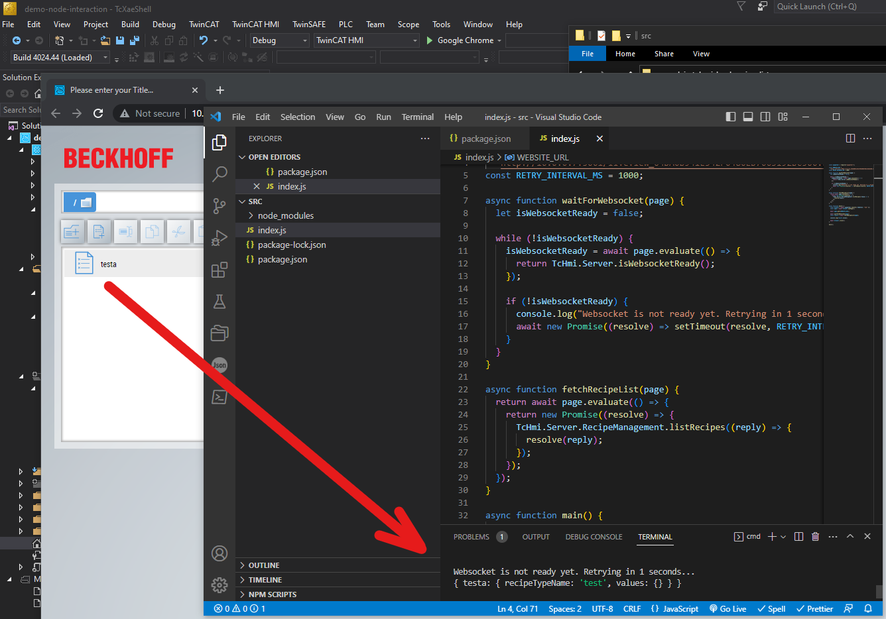

# Simple example of accessing the TcHmi API to interact with recipes

## Disclaimer

This is a personal guide not a peer reviewed journal or a sponsored publication. We make
no representations as to accuracy, completeness, correctness, suitability, or validity of any
information and will not be liable for any errors, omissions, or delays in this information or any
losses injuries, or damages arising from its display or use. All information is provided on an as
is basis. It is the reader’s responsibility to verify their own facts.

The views and opinions expressed in this guide are those of the authors and do not
necessarily reflect the official policy or position of any other agency, organization, employer or
company. Assumptions made in the analysis are not reflective of the position of any entity
other than the author(s) and, since we are critically thinking human beings, these views are
always subject to change, revision, and rethinking at any time. Please do not hold us to them
in perpetuity.

## Overview

This is a small example of accessing the TcHmi API to interact with recipes. This is a proof of concept to show that you could manage your recipe data via a node.js script. This could be adjusted to create, delete, check recipe data from an external system.

## Getting started

You must have node.js installed on your system

1. Clone the repo
2. Open the command prompt to .\src\ and type `npm install`
3. Open a TwinCAT HMI project which uses recipes in live view.
4. Copy the liveview URL and paste this in to the index.js constant WEBSITE_URL

```js
npm start
```

## Screenshot



## Need more help?

Please visit http://beckhoff.com/ for further guides
